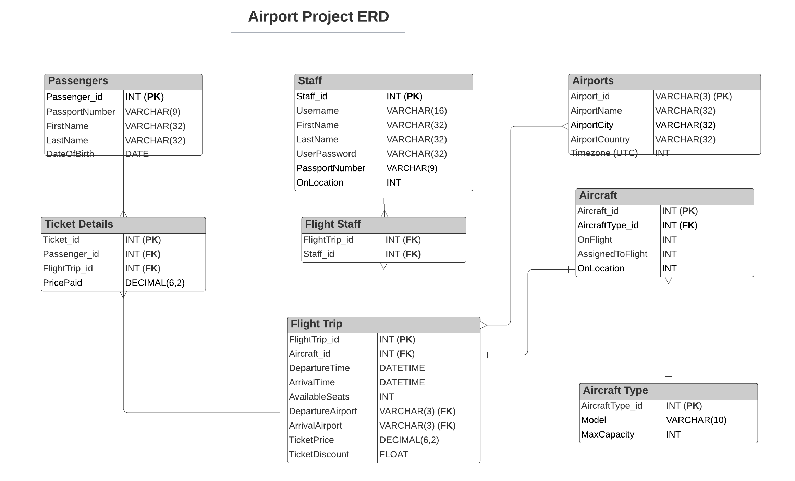

# Airport Project

Jared, Ubaid, Sam, Matt, Leo


NEW CHANGE FROM NEW BRANCH


## ERD



### Git branching
- create new branch
```git branch <new_branch>```
- switch to new branch
```git checkout <new_branch>```
- add, commit and push your changes to the repo branch
```git push -u origin <new_branch>```
- On github request a merge to main
- Discuss and accept the pull request
- Delete the old branch locally
```git branch -d <branch_to_delete>```

## PYTHON FILES

**create_person.py**
```python
# TABLES: PASSENGER
def create_passenger():
    # INPUT: FIRST NAME, LAST NAME, DOB, PASSPORT NUMBER

    # SQL QUERY TO INPUT INTO PASSENGERS TABLE

    # OUTPUT: SUCCESSFUL MESSAGE

# TABLES: STAFF
def create_staff():
    # INPUT: FIRST NAME, LAST NAME, USERNAME, PASSWORD, PASSPORT NUMBER

    # SQL QUERY TO INPUT INTO STAFF TABLE

    # OUTPUT: SUCCESSFUL MESSAGE
```

**flight_trip_manager.py**
```python
# TABLES: FLIGHT TRIP, AIRPORTS
def create_flight_trip():
    # INPUT: DEPARTURE TIME, DEPARTURE AIRPORT, ARRIVAL AIRPORT, TICKET PRICE, TICKET DISCOUNT

    # ESTIMATE ARRIVAL TIME (1 hour for now)
    
    # RETURN: FLIGHT TRIP ID


# TABLES: FLIGHT TRIP, AIRCRAFT
def assign_aircraft():
    # INPUT: FLIGHT TRIP ID

    # CHECK THAT IT's A VALID FLIGHT TRIP ID
    # FIND PLANE THAT IS AVAILABLE AND IN CORRECT LOCATION

    # RETURN: AIRCRAFT ID


# TABLES: FLIGHT TRIP, AIRCRAFT
def change_aircraft():
    # INPUT: FLIGHT TRIP ID

    # REMOVE PLANE ID AND UPDATE PLANE DETAILS TO NO LONGER HAVE DEPARTURE/ARRIVAL INFORMATION

    # CALL ASSIGN_AIRCRAFT() AGAIN
    # NEW PLANE ID = assign_aircraft()

    # RETURN: NEW AIRCRAFT ID
```

**booking_manager.py**
```python
# TABLES: TICKET DETAILS, FLIGHT TRIP, PASSENGERS
def make_booking():
    # INPUT: FLIGHT TRIP ID, LIST OF PASSENGER ID

    # CHECK HOW MANY SEATS THEY WILL NEED (BABY?)
    # CHECK THAT SEATS ARE AVAILABLE
    # IF SEATS ARE NOT AVAILABLE THEN RETURN: NOT AVAILABLE
    # OTHERWISE UPDATE NUMBER OF SEATS AVAILABLE

    # CHECK IF THEY'RE ELIGIBLE FOR DISCOUNT
    
    # FOR EACH PASSENGER
    # ADD FLIGHT TRIP ID/PASSENGER ID TO TICKET DETAILS TABLE
    # ADD COST OF TICKET TO TICKET DETAILS
    
    # RETURN: TICKET ID, COST OF TICKET (ANY DISCOUNT APPLIED), EXTRA FLIGHT DETAILS
```

**flight_attendees.py**
```python
# TABLES: FLIGHT STAFF, FLIGHT TRIP, STAFF
def assign_staff_to_flight():
    # INPUT: FLIGHT TRIP ID

    # FIND HOW MANY STAFF REQUIRED
    # CHECK WHO IS AVAILABLE

    # ASSIGN STAFF
    # UPDATE FLIGHT STAFF TABLE

    # RETURN: LIST OF STAFF ASSIGNED


# TABLES: FLIGHT TRIP, BOOKING DETAILS, FLIGHT STAFF, PASSENGERS, STAFF
def flight_attendees():
    # INPUT: FLIGHT TRIP ID

    # FIND ALL PASSENGERS/STAFF ON FLIGHT

    # RETURN: FLIGHT ATTENDEES LIST
```

**test_functions.py**
TESTING ALL ABOVE FUNCTIONS

**SQL Initial Data**
- We created some initial data to act as existing information inside the database. They can be found in the `data` directory above.
- The following data on Airports were found freely on Google.
- The different aircraft types were found on Heathrow's airport [here](https://www.heathrow.com/company/life-at-heathrow/heathrow-fan-zone/aircraft-at-heathrow).

