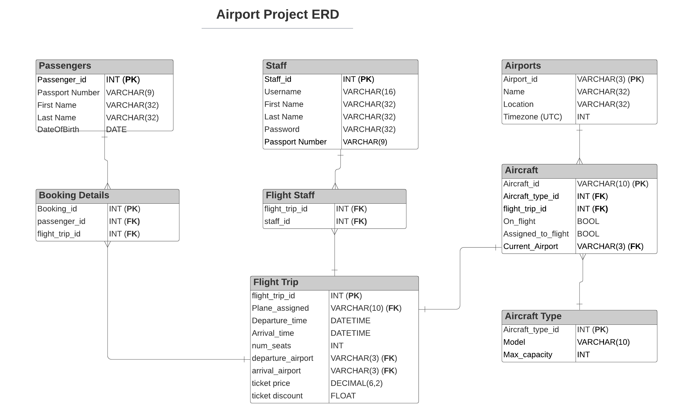

# Airport Project

Jared, Ubaid, Sam, Matt, Leo


NEW CHANGE FROM NEW BRANCH


## ERD



### Git branching
- create new branch
```git branch <new_branch>```
- switch to new branch
```git checkout <new_branch>```
- add, commit and push your changes to the repo branch
```git push -u origin <new_branch>```
- On github request a merge to main
- Discuss and accept the pull request
- Delete the old branch locally
```git branch -d <branch_to_delete>```
